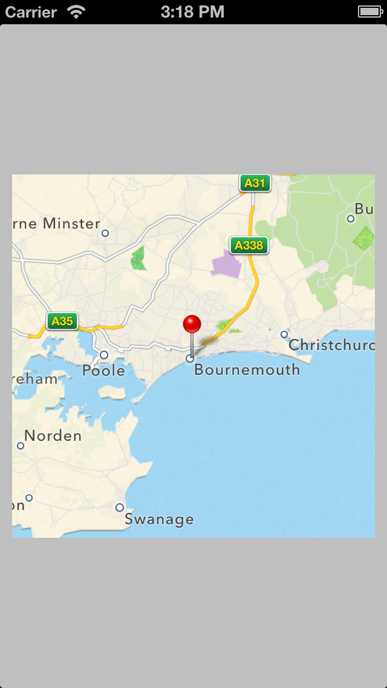

# PCMapImage
===

A simple way of generating a UIImage representation of an MKMapView. Useful if you need to apply filters to a map or don't want a MKMapView slowing down your scroll views. It also handles things like caching.

## Example

### Code

	CLLocationCoordinate2D coordinate = CLLocationCoordinate2DMake(50.718, -1.879);
	MKCoordinateRegion region = MKCoordinateRegionMake(coordinate, MKCoordinateSpanMake(0.2, 0.2));
	CGSize size = CGSizeMake(200, 200);

	[PCMapImage renderImageWithCoordinate:coordinate region:region size:size showAnnotation:YES renderCompletion:^(UIImage *image, NSError *error) {
       
		// Do something with the UIImage here
        
    }];
    
### Result

## Requirements
Ensure your project is linked against:

- MapKit
- CoreLocation
- QuartzCore

## "Gotchas"
Unfortunately MKMapView's mapViewDidFinishLoadingMap isn't called when the view is finished rendering, so I've had to use a timer to offset it by a second and a bit to allow the tiles to render. Hopefully this is fixed at somepoint. 